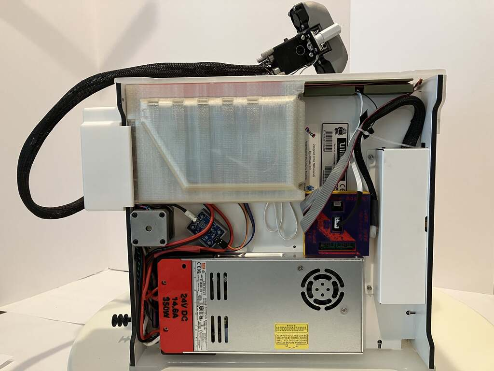

# DXU - Dual Extrusion Upgrade for Ultimaker Original+ and Ultimaker 2+

## Table of Contents

- ### [Marlin 2 firmware, calibration, and configuration instructions for DXUv2](https://github.com/ansonl/DXU/blob/master/Firmware/README.md) 

- ### [DXUv2 3D printable files](https://github.com/ansonl/DXU/tree/master/AL-DXUv2)

  - DXUv2 reuses the stock Ultimaker printhead metal parts for a more compact and durable printhead.

### Improved/Updated DXU resources are in the `AL-*` folders. 

## DXUv2

1. See [post1](https://community.ultimaker.com/topic/24553-dxu-efficient-dual-extrusion-upgrade-for-um2/?do=findComment&comment=320447) and [post2](https://community.ultimaker.com/topic/24553-dxu-efficient-dual-extrusion-upgrade-for-um2/?do=findComment&comment=323266) for DXUv2 info
1. Make all the parts in `AL-DXUv2/master parts to print/` out of high temperature plastic like SLS Nylon.
1. Make the 3 hotend holder models in `AL-DXUv2/prototyping parts/DXUv2-hotend-holder` out of aluminum. You can machine it out of the existing Ultimaker part or get it SLM printed in aluminum. I did both and the SLM printed part from UnionFab is much more precise. Have the factory use my specification PDF for the threading depths and locations. This is save you a lot of crying and pain trying to thread blind holes yourself.

## Original DXU

1. [Marlin 2 firmware for DXU](https://github.com/ansonl/Marlin-DXU)
2. Dock adapted for UMO+ frame
3. Heater clamps with 1mm thin jaws. The linked Taobao seller sells a quality all metal hotend but the heatsink flanges are only 1mm vs 2mm apart. The seller says he can do a special order of heatsinks with 2mm flange spacing with a minimum order quantity of 50. 
4. Cura profile with calibration and improvements for DXU UMO+ are merged into Cura. 
5. Input Shaping calibration gcode and presets.

## Cura profile notes

I have not had time to update all the downloadable Cura profiles with the better adaptive start/end gcode located in `AL-DXUv2/start-end-gcode`. Please copy and paste them into your Cura printer settings to use them.

### DISCUSSION:
https://community.ultimaker.com/topic/24553-dxu-another-dual-extrusion-upgrade-for-um2/

### CREDITS:

##### DXU:  
Original DXU by yyh1002

DXU variant by benleo888
##### Hardware:  
Lever action is inspired by Ultimaker 3.   
##### Firmware:   
Marlin 2 firmware
