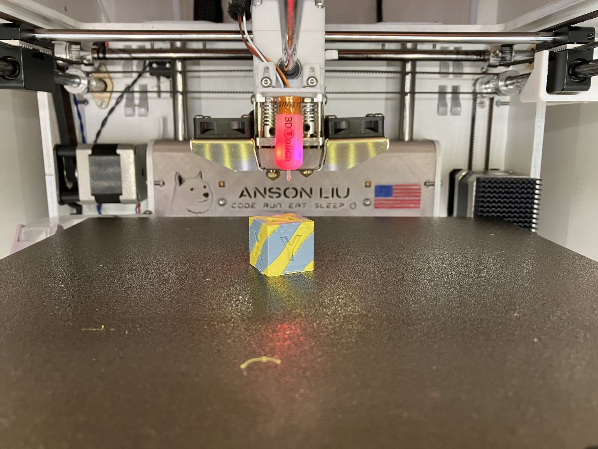

# DXU - Dual Extrusion Upgrade for Ultimaker Original+ and Ultimaker 2+

## Improved DXUv2 files are now available

1. DXUv2 reuses the stock Ultimaker printhead metal parts for a more compact and durable printhead.

### Improved/Updated DXU resources are in the `AL-*` folders. 

## Marlin 2.1.2 Input Shaping skips steps at high speeds  [Marlin#25117](https://github.com/MarlinFirmware/Marlin/issues/25117)! Please see issue linked for info and possible fixes. 

- DXU functionality is possible in Marlin 2 with the following code improvements in Marlin [PR#24553](https://github.com/MarlinFirmware/Marlin/pull/24553), [PR#24797](https://github.com/MarlinFirmware/Marlin/pull/24797), [PR#25399](https://github.com/MarlinFirmware/Marlin/pull/25399), [PR#23466](https://github.com/MarlinFirmware/Marlin/pull/23466)

## Notes for original DXU

1. [Marlin 2 firmware for DXU](https://github.com/ansonl/Marlin-DXU)
2. Dock adapted for UMO+ frame
3. Heater clamps with 1mm thin jaws. The linked Taobao seller sells a quality all metal hotend but the heatsink flanges are only 1mm vs 2mm apart. The seller says he can do a special order of heatsinks with 2mm flange spacing with a minimum order quantity of 50. 
4. Cura profile with calibration and improvements for DXU UMO+ are merged into Cura. 
5. Input Shaping calibration gcode and presets. 

### Marlin 2 configuration directions:

  - Determine second extruder Z offset by manually adjusting Z position while `T0` is selected in firmware and `T1` is physically active.

### DISCUSSION:
https://community.ultimaker.com/topic/24553-dxu-another-dual-extrusion-upgrade-for-um2/

### CREDITS:

##### Original DXU:  
Original DXU by yyh1002
##### Hardware:  
Lever action is inspired by Ultimaker 3.   
##### Firmware:   
Marlin 2 firmware
